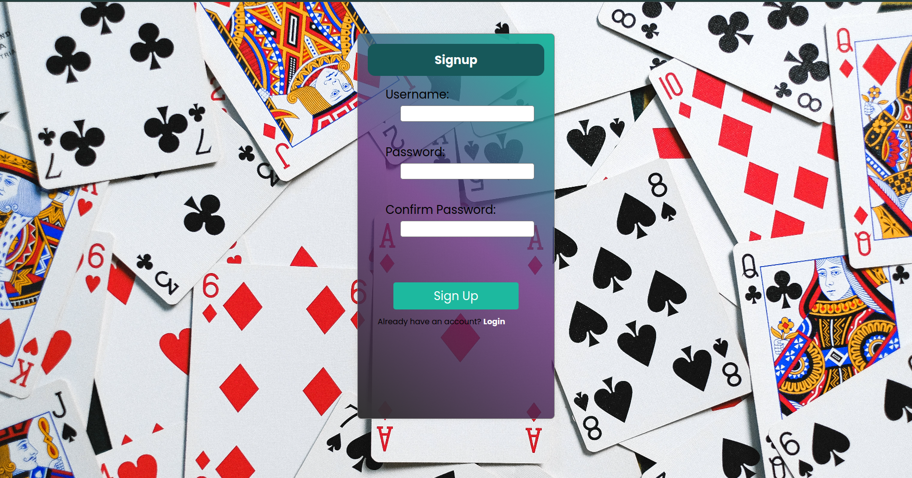
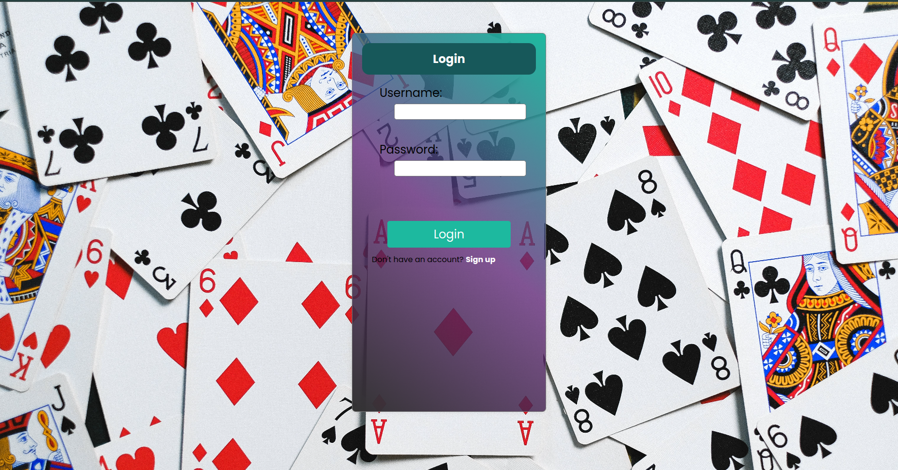
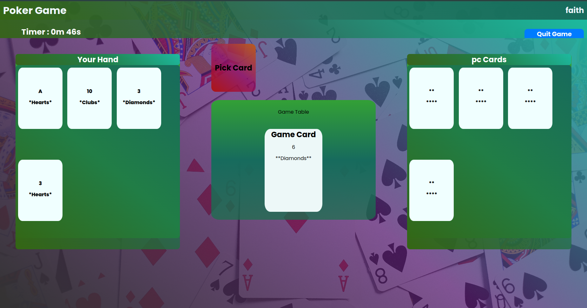
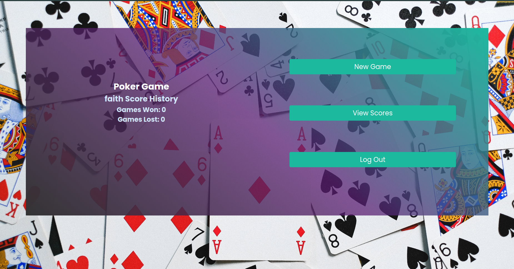

# WELCOME TO POKER LAND

Welcome to Poker Land, where the thrill of the cards meets the excitement of competition! Whether you're a seasoned poker pro or a newcomer looking to learn the ropes, Poker Land is the place for you. This README guide will walk you through the key features and functionalities of our platform, ensuring you have an unforgettable poker experience.

## Getting Started
To embark on your Poker Land journey, start by cloning the Poker Land repository to your local machine. Follow the steps below to set up Poker Land on your preferred development environment. We support Windows, macOS, and Linux platforms.

1. Clone the Repository
To get started with Poker Land, clone the repository to your local machine:
```bash
git clone https://github.com/PokerLandRepo.git
```

2. Navigate to the Project Directory
Change into the directory where Poker Land has been cloned:
```bash
cd PokerLand
```

3. Installing Dependencies
Ensure you have all the necessary dependencies installed

```bash
#client side
cd client
npm install
npm start
#server side
cd server
#start a virtual enviroment(optionall but recommended)
pip install -r requirements.txt
python app.py #(or python3 app.py if not using enviroment)
```

# It's time to dive into the game!

## Account Creation
Create a personalized account to track your progress, accumulate achievements, and engage with the Poker Land community. Your account ensures a seamless experience across devices.

## SIGNUP
Create a new account by clicking signup and registering Information




## LOGIN
If you have an account Login to play just enter your username and password




### Play A NEW GAME

How the Game Works

#### Gameplay:

1. **Turn Order**: The previous game's winner or dealer begins. Play proceeds clockwise.
2. **Playing Cards**: On their turn, a player must play a card matching the suit or rank of the top card on the discard pile. If unable, they must draw a card from the draw pile.
3. **Special Card Rules**:
   - **Question Cards**: If a player plays a Queen or an 8, they must also play a matching Answer Card. Failure to do so requires drawing a card.
   - **Penalty Cards**: Playing a 2 or 3 forces the next player to draw 2 or 3 cards, respectively, unless they can play a Penalty Card of the same rank or an Ace.
   - **Ace Cards**: The player can declare the suit for the next turn.

4. Draw Pile Exhaustion: If the draw pile runs out, shuffle the discard pile (excluding the top card) to create a new draw pile.




### Computer CPU Logic:

1. The Goal of the computer is to have the least amount of cards by following the rules.
2. Once the player plays a card, the computer may figure the easiest way to get to zero cards.
3. The computer checks its cards and figures out the best move against the previously played card. For example, if the previous player has just played H6 and the computer has H8, C6, and D2, the computer can only play cards with the same suit or the same number. If a player has an Ace, they can put it at any time or change the suit.
4. Picking up a new card is the worst move because it contradicts the main goal of having the fewest cards.
5. If the computer is cardless, it declares itself as "cardless."
6. Multiple cards can be put down if they are the same suit or the same number.
7. Penalty Attack Cards (2s and 3s):
   - If a player puts down a 2, the next player must pick 2 cards as a penalty. The same case applies to 3. If a player wants to decline the penalty, they can counter by putting down 2 or 3 as well. The additional declining cards act as a counter, and the last player should pick the total of all attack cards shown. If a player places D2, the computer can play C3, S3, then the player can counter by playing C2. If the computer does not have any counter cards available, it must pick 10 cards from the deck.

### VIEW SCORES
The "View Scores" component provides users with a comprehensive overview of their gaming performance and history. It serves as a dashboard for tracking the outcomes of past poker games, showcasing key statistics such as the number of games won and lost.


#### Features:
 - Automatic Score Retrieval: Upon component mount, the system automatically retrieves the user's score data from the server, eliminating the need for manual updates.

 - Efficient Data Processing: The component intelligently processes the score data, categorizing wins and losses accurately to provide an up-to-date summary.

 - Responsive Design: The user interface adapts to various screen sizes, ensuring a consistent and user-friendly experience across devices.


#### Navigation:


 - New Game: Users can initiate a new poker game directly from the "View Scores" component, enhancing the seamless transition between different sections of the application.

 - Logout: For convenience, users have the option to log out directly from the component, facilitating smooth navigation within the gaming platform. 


#### Loading Indicator:
 - User-Friendly Loading State: During the data-fetching process, a loading indicator is displayed to keep users informed about ongoing operations and ensure a positive user experience.

#### Use Case:
  - The "View Scores" component is particularly useful for users who want to track their gaming progress, analyze trends, and celebrate achievements. Whether aiming for a winning streak or strategizing to improve performance, users can rely on this component for valuable insights into their poker gaming history. 


###  LOGOUT
The "Logout" feature allows users to securely end their gaming session within the application.

#### Features:

 - Secure Sign-out: Ensures users are safely logged out, protecting their account information.
 - Smooth Transition: Redirects users to the login or home page for a seamless experience.
#### Functionality:

 - Session Termination: Ends the current session to prevent unauthorized access.
 - Data Clearance: Clears locally stored user-specific data for privacy.
 - Confirmation Prompt: Prompts users to confirm their intention to log out.

#### Navigation:

Post-Logout Page: Redirects users to a designated landing page.